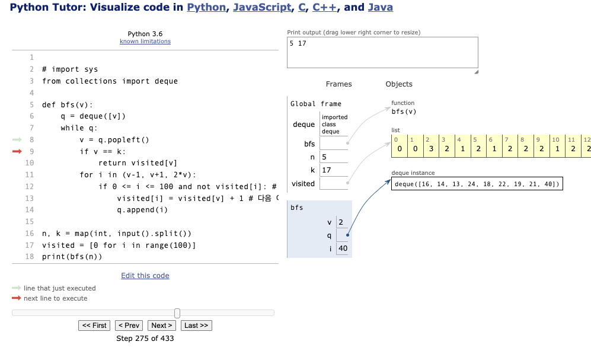

# bfs 알고리즘에 대해서

### 1. 알고리즘 2주차가 지나가고 있다.

- 사실 알고리즘 관련해서는 이 알고리즘은 이것이다! 정도의 개념만 알고 있었고, 그것을 코드로 구현하는 것에는 어려움을 갖고 있었다.
- 그런데 정글에 와서 일하면서는 절대 시도하지 못했을 알고리즘을 공부하니까 좋다. 언제 배워보겠어 알고리즘을!!
- 첫주차 키워드 : 배열, 문자열, 반복문과 재귀함수, 계산복잡도, 정렬, 완전탐색, 정수론, 분할정복, 이분탐색
- 이주차 키워드 : 스택, 큐, 우선순위 큐, 그래프, BFS, DFS, 위상정렬

### 2. BFS(breadth First Search) 란?

- 그래프의 모든 노드를 순회하는 방법중 하나로, DFS와 다르게 너비를 우선으로 탐색한 후 인접한 노드부터 탐색하는 알고리즘.
- DFS는 스택을 사용하고 BFS는 큐 자료구조를 이용한다.
- 시작 노드로부터 거리에 따라 단계별로 탐색을 한다.
- 일반적으로 큐에 초기값을 넣고, 큐가 있는동안 만들어놓은 graph list 를 순회하며 방문하지 않은 노드를 큐에 넣어서 탐색하는 방식으로 진행된다.

### 3. 문제를 통해서 더 자세히 알아보자

- 백준 1697 문제 [1697번: 숨바꼭질](https://www.acmicpc.net/problem/1697)

- 동생을 찾기위한 최소 step 을 찾는 문제이다.
- 전체코드

```python
import sys
from collections import deque

def bfs(v):
    q = deque([v])
    while q:
        v = q.popleft()
        if v == k:
            return visited[v]
        for i in (v-1, v+1, 2*v):
            if 0 <= i <= 100000 and not visited[i]:
                visited[i] = visited[v] + 1 # 다음 이동한 위치에 현재 이동한 시간 표시
                q.append(i)

n, k = map(int, sys.stdin.readline().split())
visited = [0 for i in range(100001)]
print(bfs(n))
```

- 입력값 5 , 17
- 처음 순회값
  q = ([5]) (출발장소)
  visited = [0,0,0…]
  v = 5
  i = 4( 5-1), 6(5+1), 10(5\*2) 순회
  i=4일떄, 아직 방문하지 않았으므로 visited[4] = visited[5]+1 =1
  q = ([4])
  i=6일때, 아직 방문하지 않았으므로 visited[6] =visited[5]+1 =1
  q = ([4,6])
  i = 10일때 , 방문안했으니 visited[10] = visited[5]+1 = 1
  q = ([4,6,10])
- 다음 순회값
  v = 4
  i = 3, 5, 8순회 …
  i=3 일때 방문x visited[3] = visited[4] +1 = 2
  q=([6,10,3])
  i =5 일때 방문x visited[5] = visited[4]+1 = 2
  q = ([6,10,3,5)]
  i=8일때 방문 x visited[8] = visited[4] +1 = 2
  q = ([6,10,3,5,8])
  그리고 다음 순회값때 v =6이 된다!
- 그렇게 계속 순회를 하게 되고 동생이 있는 칸을 만나게 되면 visited값을 return 하게 된다.

  

- 처음에 개념만 들었을때는 어떻게 순회하는거지? 라는 의문이 있었는데 단계별로 하나하나 찍어보니까 금방 이해할 수 있었다.
- 깊이가 깊지 않지 않은 경우의 탐색일때 유리하다.
- 일단 모르겠을때는 visited 에 어떤 값을 저장해야하지? 로부터 생각을 시작하면 해결할 수 있었다!

### 3. 이번주 회고

개념을 이해하고는 있는것 같은데 새로운 문제를 보면 또 새롭다.하지만 나만 그런것은 아닌거 같다.

내가 정말 잡생각이 많은 사람이었다는 생각이 든다. 이걸 공부하는게 맞나? 이게 실무에 쓰일까?

하지만 그런 생각을 할시간에 눈앞에서 나를 기다리고 있는 문제들에 집중하니 그냥 잡생각이 사라졌다.

Just Do It. 그냥 공부해. 앞에 있는 개념을 내가 모르겠다면, 그냥 이해하는데 최선을 다해라. 이해가 안되면 일단 코드라도 쳐보자. 그런 마음으로 보내고 있다. 하루가 참 심플한데 뿌듯하다.
